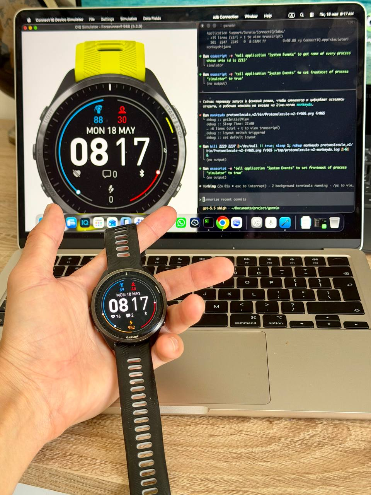

# mh-balance_garmin

A minimalist Garmin Connect IQ watch face focused on what really matters: energy and stress.[page:1]



## Overview

I built this watch face because I wanted my Garmin home screen to show only 2 signals that matter most to me:

- Blue bar — Body Battery.
- Red bar — Stress.

Most watch faces are either overloaded with training metrics or designed mainly to look nice.  
This one is different: it is built for people who manage energy, not just workouts.[page:1]

## Why it matters

For me, Body Battery is not just another health number.  
It is a simple indicator of current condition.

When energy drops below 30, that is a signal to slow down, recover, and stop pushing the body further.  
You cannot drain your energy to zero every day and expect sleep to fully restore it.[page:1]

## Layout

The current layout includes:

- Outer orbit — steps.
- Left inner orbit — Body Battery.
- Right inner orbit — stress level.
- Bottom fields — heart rate, notifications, Bluetooth.[page:1]

## Build

Build for Forerunner 965:

```bash
JAVA_TOOL_OPTIONS='-Duser.home=/Users/bronxtc52' \
monkeyc -f monkey.jungle -d fr965 -o bin/mh-balance-fr965.prg -y ../garmin/keys/developer_key.der -w
```

Run in the Connect IQ simulator:

```bash
connectiq monkeydo bin/mh-balance-fr965.prg fr965
```

## Upload

See [UPLOAD.md](./UPLOAD.md) for the device upload workflow.[page:1]

## License

This watch face is GPL-3.0 licensed.  
It is derived from an open source Garmin watch face, and upstream font/icon attributions are preserved in this repository.[page:1]
